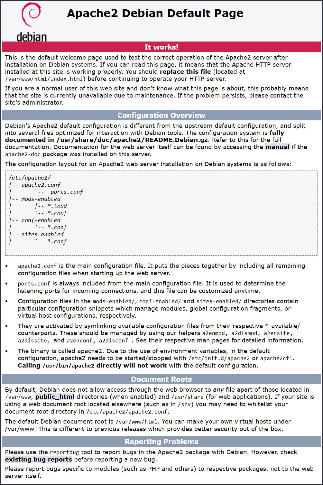

# Apache HTTP Server

[Apache HTTP Server](https://httpd.apache.org/), spesso chiamato semplicemente **Apache**, è un server web open source molto diffuso, sviluppato e mantenuto dalla Apache Software Foundation.  

Il suo scopo principale è gestire le richieste HTTP provenienti dai client (ad esempio i browser), servendo pagine web, risorse statiche (immagini, file CSS/JS) oppure instradando applicazioni web dinamiche tramite moduli.  

Progettato per essere **sicuro**, **efficiente** ed **estensibile**, Apache offre un’architettura modulare che consente di aggiungere funzionalità come il rewriting degli URL, l’autenticazione o l’utilizzo come proxy, adattandosi a diverse esigenze.

---

## 🔹 Installazione di Apache

Installiamo apache lanciando il comando:

```bash
sudo apt install apache2 libapache2-mod-fcgid
```

Al termine del processo di installazione e aver avviato apache se apri un browser e digiti:

```
http://tuo-server/
```

dovrebbe comparire la pagina web di default di apache.

<p align="center">
  
</p>

⚠️ **Nota bene:**  
Se la pagina di default di Apache non dovesse essere visibile, verifica che il **firewall** non stia bloccando la porta **80** (HTTP).  

Su sistemi con `ufw`, ad esempio, puoi aprire la porta con:  

```bash
sudo ufw allow 80/tcp
sudo ufw reload
```

Se invece usi HTTPS, ricordati di aprire anche la porta **443**:  

```bash
sudo ufw allow 443/tcp
sudo ufw reload
```

---

## 🔹 Configurazione Virtual Host per QGIS Server

Per far funzionare qgis-server su apache e quindi esporre i servizi, bisogna configurare un virtual host.  

Lascio la configurazione di default di apache ```000-default.conf``` e creo un nuovo virtual host con la configurazione suggerita dalla guida, ma apportando alcune modifiche necessarie al mio caso per far funzionare la configurazione, quindi:

Creiamo subito il file **`gisserver.conf`** in `/etc/apache2/sites-available/` con il comando:

```bash
sudo nano /etc/apache2/sites-available/gisserver.conf
```

Con le seguenti impostazioni:

```apache
<VirtualHost *:80>
  ServerAdmin webmaster@localhost
  ServerName  disipio.io
  
  DocumentRoot /var/www/html

  # Apache logs (diversi dai log di QGIS Server)
  ErrorLog ${APACHE_LOG_DIR}/gisserver.error.log
  CustomLog ${APACHE_LOG_DIR}/gisserver.access.log combined

  # Timeout più lungo per WPS... default = 40
  FcgidIOTimeout 120

  FcgidInitialEnv LC_ALL "en_US.UTF-8"
  FcgidInitialEnv PYTHONIOENCODING UTF-8
  FcgidInitialEnv LANG "en_US.UTF-8"

  # QGIS log
  FcgidInitialEnv QGIS_SERVER_LOG_STDERR 1
  FcgidInitialEnv QGIS_SERVER_LOG_LEVEL 0

  # cartella contenente i progetti QGIS
  SetEnv QGIS_PROJECT_PATH /giserver/

  # QGIS_AUTH_DB_DIR_PATH deve puntare a una cartella scrivibile dall’utente FCGI (www-data)
  FcgidInitialEnv QGIS_AUTH_DB_DIR_PATH "/gisserver/qgisserverdb/"
  FcgidInitialEnv QGIS_AUTH_PASSWORD_FILE "/gisserver/qgisserverdb/qgis-auth.db"

  # Configurazione per accesso PostgreSQL via pg_service
  SetEnv PGSERVICEFILE /gisserver/.pg_service.conf
  FcgidInitialEnv PGPASSFILE "/gisserver/.pgpass"

  # Dove si trova qgis_mapserv.fcgi
  ScriptAlias /cgi-bin/ /usr/lib/cgi-bin/
  <Directory "/usr/lib/cgi-bin/">
    AllowOverride None
    Options +ExecCGI -MultiViews -SymLinksIfOwnerMatch
    Require all granted
  </Directory>

  <IfModule mod_fcgid.c>
    FcgidMaxRequestLen 26214400
    FcgidConnectTimeout 60
  </IfModule>
</VirtualHost>
```

---

## 🔹 Creazione cartelle necessarie

Creiamo ora le cartelle che ospiteranno i progetti e i registri di QGIS Server e il database di autenticazione:

```bash
# cartella log dedicata a QGIS Server
sudo mkdir -p /var/log/qgis/
```

```bash
# cartella database di autenticazione
sudo mkdir -p /gisserver/qgisserverdb
```

```bash
# file database autenticazione (se non già presente)
sudo touch /gisserver/qgisserverdb/qgis-auth.db
```

```bash
# cartella progetti QGIS
sudo mkdir -p /gisserver/
# diamo i permessi a gisadmin
sudo chown -R gisadmin:gisadmin /gisserver
```

---

## 🔹 Abilitazione Virtual Host e moduli

Ora possiamo abilitare l’host virtuale e il mod `fcgid`, se non è già stato fatto:

```bash
sudo a2enmod fcgid
sudo a2enmod rewrite
sudo a2ensite gisserver.conf
```

Ora riavvia Apache per usare la nuova configurazione:

```bash
sudo systemctl restart apache2
```

---

## 🔹 Progetto di esempio

Sul sito ho messo a disposizione un file zip contenente un esempio di progetto qgis con i confini amministrativi dei comuni italiani da scaricare al link:  

👉 [www.disipio.io/ComuniISTAT.zip](http://www.disipio.io/ComuniISTAT.zip)

per poter testare le funzionalità di qgis-server.

---

## 🔹 Test finale

Adesso se tutto è andato a buon fine, al seguente link dovresti vedere le **capabilities** del progetto pubblicato:

```
http://disipio.io/cgi-bin/qgis_mapserv.fcgi?SERVICE=WMS&VERSION=1.3.0&REQUEST=GetCapabilities&MAP=/gisserver/datigis/ComuniItaliani/ComuniISTAT.qgz
```
