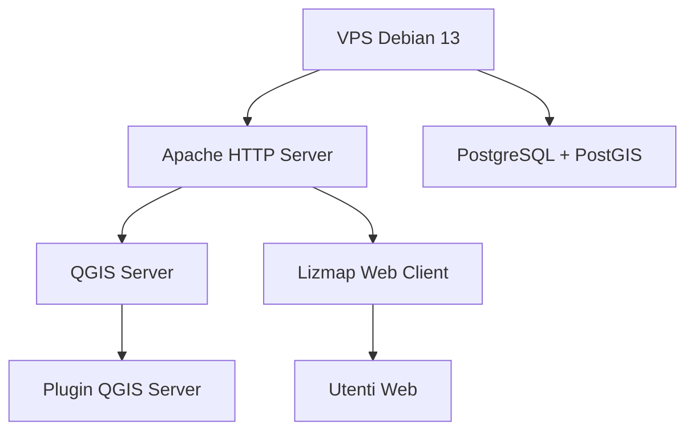

# 🌍 StackGIS / VPS / QGIS / QGIS Server / Lizmap

***StackGIS*** è un progetto dedicato all’installazione, configurazione e gestione di una VPS per l’erogazione di servizi GIS con **QGIS Server** e **Lizmap**.  
Il repository raccoglie la documentazione tecnica necessaria per replicare e mantenere l’infrastruttura, facilitando la gestione sistemistica e l’aggiornamento dei servizi cartografici nel tempo.

---

## 🛠️ Tecnologie

<table align="center">
  <tr>
    <td align="center" style="border: none; padding: 0 50px;">
       
      <b>Debian</b>
    </td>
    <td align="center" style="border: none; padding: 0 50px;">
       
      <b>QGIS</b>
    </td>
    <td align="center" style="border: none; padding: 0 50px;">
       
      <b>Apache</b>
    </td>
    <td align="center" style="border: none; padding: 0 50px;">
       
      <b>PostGIS</b>
    </td>
    <td align="center" style="border: none; padding: 0 50px;">
       
      <b>Python</b>
    </td>
    <td align="center" style="border: none; padding: 0 50px;">
       
      <b>Lizmap</b>
    </td>
</tr>
</table>

---

## 📂 Contenuto

1. 🖥️ [01 - Dati della macchina](01-server-data.md)  
   Descrizione tecnica e caratteristiche della VPS (sistema operativo, risorse e configurazione iniziale).

2. 👤 [02 - Creazione utenti](02-creazione-utenti.md)  
   Procedura per la creazione e configurazione dell’utente amministrativo con accesso SSH e privilegi di gestione.

3. 🗺️ [03 - Installazione QGIS Server](03-Installazione-qgis-server.md)  
   Installazione e verifica del servizio **QGIS Server** su Debian 13.

4. 🪶 [04 - Installazione e configurazione di Apache](04-Installazione-configurazione-Apache.md)  
   Configurazione di **Apache HTTP Server** per servire QGIS Server tramite FastCGI e moduli dedicati.

5. 🔌 [05 - Installazione Plugin QGIS Server](05-Installazione-Plugin-Qgis-Server.md)  
   Installazione e configurazione dei plugin Python per **QGIS Server** (Lizmap, AtlasPrint, ecc.).

6. 🧩 [06 - Installazione PHP](06-Installazione-PHP.md)  
   Installazione e configurazione di **PHP 8.4** e dei moduli richiesti per **Lizmap Web Client**.

7. 🐘 [07 - Installazione PostgreSQL / PostGIS](07-Installazione-Postgresql-PostGIS.md)  
   Installazione del database **PostgreSQL** con estensione **PostGIS** e configurazione degli utenti.

8. 🌐 [08 - Installazione Lizmap Web Client](08-Installazione-di-Lizmap.md)  
   Installazione di **Lizmap Web Client**, configurazione delle API, dei plugin e collegamento a **QGIS Server**.

9. 🔒 [09 - Hardening VPS](09-hardening-VPS.md)  
   Messa in sicurezza della VPS con **UFW**, **Fail2ban** e aggiornamenti automatici del sistema.

10. 🧾 [10 - Installazione Certificati SSL](10-Installazione-Certificati-SSL.md)  
    Installazione e configurazione dei certificati **SSL/TLS** per l’attivazione di connessioni HTTPS e la protezione dei servizi pubblicati.

---

## 🏗️ Architettura

---

## 🎯 Obiettivo

Il repository funge da **documentazione tecnica** e da **promemoria operativo** delle procedure eseguite sulla VPS.  
Serve come riferimento per riprodurre, aggiornare o mantenere nel tempo l’intera infrastruttura GIS.  

👉 Obiettivo finale: realizzare un’**infrastruttura GIS completa**, sicura e documentata, pronta per la pubblicazione di servizi cartografici basati su **QGIS Server + Lizmap**.

---

## 🧾 Licenza

Il progetto è distribuito con licenza **MIT**.  
I contenuti possono essere riutilizzati e adattati liberamente, citando la fonte originale.
