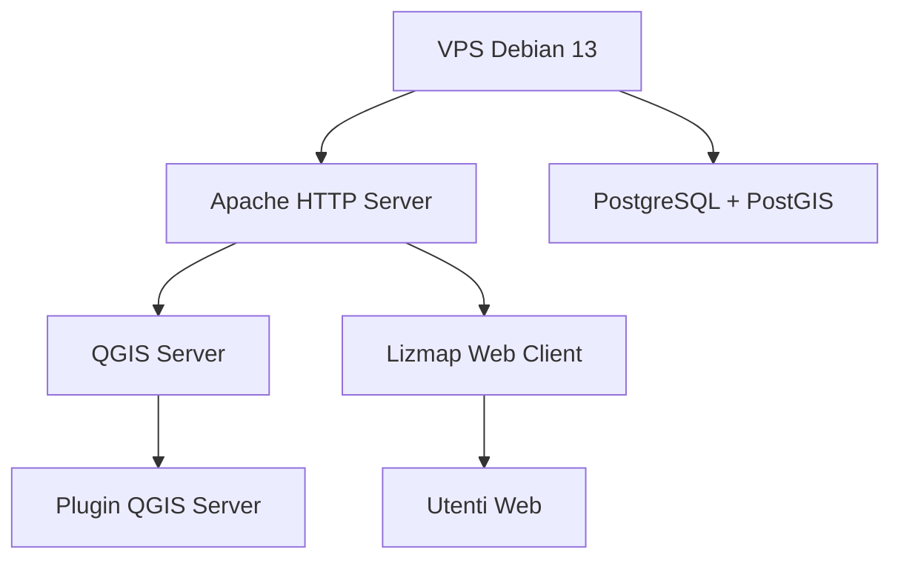

# 🌍 StackGIS — Infrastruttura GIS su VPS (QGIS Server + Lizmap)

**StackGIS** è un progetto open-source dedicato alla **configurazione completa di una VPS** per l’erogazione di servizi GIS basati su **QGIS Server** e **Lizmap Web Client**.  
Il repository funge da **documentazione tecnica** e da **guida operativa** per installare, configurare e mantenere un’infrastruttura geospaziale scalabile e sicura.

---

## 🛠️ Tecnologie principali

<table align="center">
  <tr>
    <td align="center" style="border: none; padding: 0 40px;">
       
      <b>Debian 13</b>
    </td>
    <td align="center" style="border: none; padding: 0 40px;">
       
      <b>QGIS Server</b>
    </td>
    <td align="center" style="border: none; padding: 0 40px;">
       
      <b>Apache HTTP Server</b>
    </td>
    <td align="center" style="border: none; padding: 0 40px;">
       
      <b>PostgreSQL + PostGIS</b>
    </td>
    <td align="center" style="border: none; padding: 0 40px;">
       
      <b>Python</b>
    </td>
    <td align="center" style="border: none; padding: 0 40px;">
       
      <b>Lizmap Web Client</b>
    </td>
  </tr>
</table>

---

## 📂 Contenuto del repository

| # | File | Descrizione |
|--|--|--|
| 01 | [01-server-data.md](01-server-data.md) | Specifiche tecniche della VPS e configurazione iniziale. |
| 02 | [02-creazione-utenti.md](02-creazione-utenti.md) | Creazione e hardening dell’utente amministrativo. |
| 03 | [03-Installazione-qgis-server.md](03-Installazione-qgis-server.md) | Installazione di **QGIS Server** su Debian 13. |
| 04 | [04-Installazione e configurazione di Apache.md](04-Installazione%20e%20configurazione%20di%20Apache.md) | Configurazione di **Apache HTTP Server** e integrazione FastCGI. |
| 05 | [05-Installazione-Plugin-Qgis-Server.md](05-Installazione-Plugin-Qgis-Server.md) | Installazione e gestione dei plugin di QGIS Server. |
| 06 | [06-Installazione-PHP.md](06-Installazione-PHP.md) | Installazione e configurazione di **PHP 8.4** per Lizmap. |
| 07 | [07-Installazione-Postgresql-PostGIS.md](07-Installazione-Postgresql-PostGIS.md) | Installazione e configurazione di **PostgreSQL + PostGIS**. |
| 08 | [08-Installazione-di-Lizmap.md](08-Installazione-di-Lizmap.md) | Installazione e configurazione di **Lizmap Web Client**. |
| 09 | [09-hardening-VPS.md](09-hardening-VPS.md) *(da aggiungere)* | Sicurezza e ottimizzazione del sistema. |
| 10 | [10-Installazione-Certificati-SSL.md](10-Installazione-Certificati-SSL.md) | Installazione di **Certbot** e configurazione HTTPS con Let’s Encrypt. |

---

## 🏗️ Architettura generale

---

## ⚙️ Requisiti minimi

| Componente | Specifica consigliata |
|-------------|-----------------------|
| **CPU** | 2 vCore o superiore |
| **RAM** | 4 GB o superiore |
| **Disco** | 100 GB SSD |
| **OS** | Debian 13 (Trixie) o compatibile |
| **Accesso** | SSH con chiave pubblica |
| **Porte** | 80 (HTTP), 443 (HTTPS), 8080 (QGIS Server) |

---

## 🎯 Obiettivo del progetto

Fornire una **guida strutturata e riproducibile** per implementare un’infrastruttura GIS completa:
- **Server cartografico** basato su QGIS Server  
- **Frontend web** Lizmap per la pubblicazione di mappe  
- **Database spaziale** PostgreSQL/PostGIS  
- **Sicurezza e hardening** della VPS  
- **Gestione certificati** e HTTPS automatizzato  

---

## 🔒 Privacy e anonimizzazione

Il progetto è concepito come **template open-source**:  
tutti i riferimenti a domini o utenti reali sono stati sostituiti da valori generici (`example.io`, `stackgis.local`, ecc.) per garantire la privacy.

---

## 🧾 Licenza

Questo progetto è distribuito sotto licenza **MIT**.  
È consentito l’uso, la modifica e la ridistribuzione del materiale, a condizione di mantenere l’attribuzione originale e la licenza.

---

## 📘 Stato del progetto

🧩 Documentazione: completa fino al livello applicativo  
🛡️ Sicurezza: in corso di integrazione (09-hardening-VPS.md)  
🚀 Obiettivo finale: infrastruttura GIS pronta alla produzione
