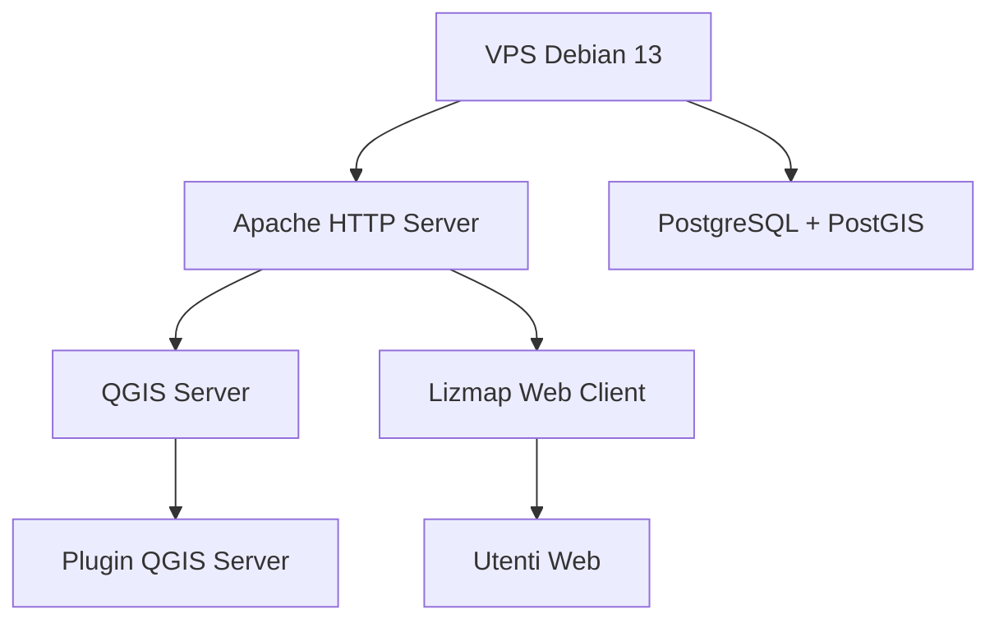

# 🌍 StackGIS / VPS / QGIS / QGIS Server / Lizmap

***StackGIS*** è un progetto dedicato all’installazione, configurazione e gestione di una VPS per l’erogazione di servizi GIS con **QGIS Server** e **Lizmap**.  
Questo repository raccoglie la documentazione tecnica necessaria per replicare e mantenere l’infrastruttura, facilitando sia la gestione sistemistica sia l’aggiornamento dei servizi cartografici.

---

## 🛠️ Tecnologie

<table align="center">
  <tr>
    <td align="center" style="border: none; padding: 0 50px;">
       
      <b>Debian</b>
    </td>
    <td align="center" style="border: none; padding: 0 50px;">
       
      <b>QGIS</b>
    </td>
    <td align="center" style="border: none; padding: 0 50px;">
       
      <b>Apache</b>
    </td>
    <td align="center" style="border: none; padding: 0 50px;">
       
      <b>PostGIS</b>
    </td>
    <td align="center" style="border: none; padding: 0 50px;">
       
      <b>Python</b>
    </td>
    <td align="center" style="border: none; padding: 0 50px;">
       
      <b>Lizmap</b>
    </td>
</tr>
</table>

---

## 📂 Contenuto

1. 🖥️ [01 - Dati della macchina](01-server-data.md)  
   Dettagli tecnici e caratteristiche della VPS (sistema operativo, risorse, configurazione iniziale).

2. 👤 [02 - Creazione utenti](02-creazione-utenti.md)  
   Creazione e configurazione dell’utente `gisadmin` con accesso SSH e privilegi amministrativi.

3. 🗺️ [03 - Installazione QGIS Server](03-Installazione-qgis-server.md)  
   Installazione e verifica del servizio **QGIS Server** su Debian 13.

4. 🪶 [04 - Installazione e configurazione di Apache](04-Installazione%20e%20configurazione%20di%20Apache.md)  
   Configurazione di **Apache** per servire QGIS Server tramite FastCGI.

5. 🔌 [05 - Installazione Plugin QGIS Server](05-Installazione-Plugin-Qgis-Server.md)  
   Installazione e configurazione dei plugin Python per QGIS Server (Lizmap, AtlasPrint, ecc.).

6. 🧩 [06 - Installazione PHP](06-Installazione-PHP.md)  
   Installazione e configurazione di **PHP 8.4** e moduli richiesti per Lizmap Web Client.

7. 🐘 [07 - Installazione PostgreSQL / PostGIS](07-Installazione-Postgresql-PostGIS.md)  
   Installazione del database **PostgreSQL** con estensione **PostGIS** e configurazione utenti.

8. 🌐 [08 - Installazione Lizmap Web Client](08-Installazione-di-Lizmap.md)  
   Installazione di **Lizmap Web Client**, configurazione API, plugin e collegamento a QGIS Server.

9. 🔒 [09 - Hardening VPS](09-hardening-VPS.md)  
   Messa in sicurezza finale della VPS con **UFW**, **Fail2ban** e aggiornamenti automatici.

---

## 🏗️ Architettura

---

## 🎯 Obiettivo

Questo repository funge da **documentazione tecnica** e da **promemoria** delle operazioni effettuate sulla VPS, utile per riprodurre o mantenere la configurazione in futuro.

👉 Obiettivo finale: **un’infrastruttura GIS completa**, sicura e documentata, pronta per la pubblicazione di servizi cartografici con **QGIS Server + Lizmap**.

---

## 🧾 Licenza

Questo progetto è distribuito con licenza **MIT**.  
Puoi riutilizzare e adattare i contenuti, citando la fonte originale.

---

## 👨‍💻 Autore

**Antonio Di Sipio**  
🌐 [github.com/AntonioDiSipio](https://github.com/AntonioDiSipio)  
📧 *Contatti e collaborazione su richiesta.*
